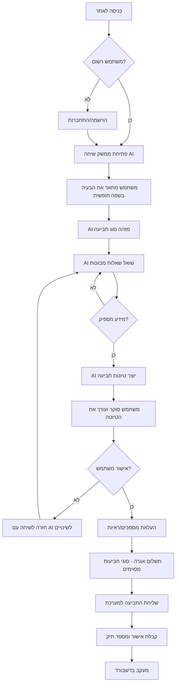
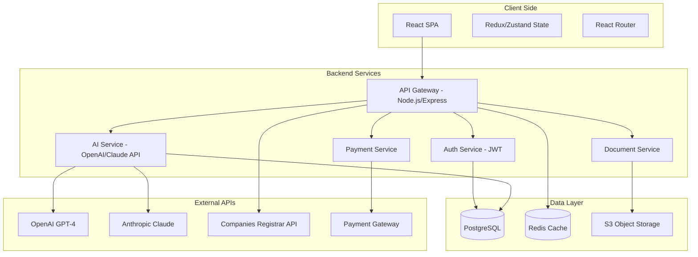
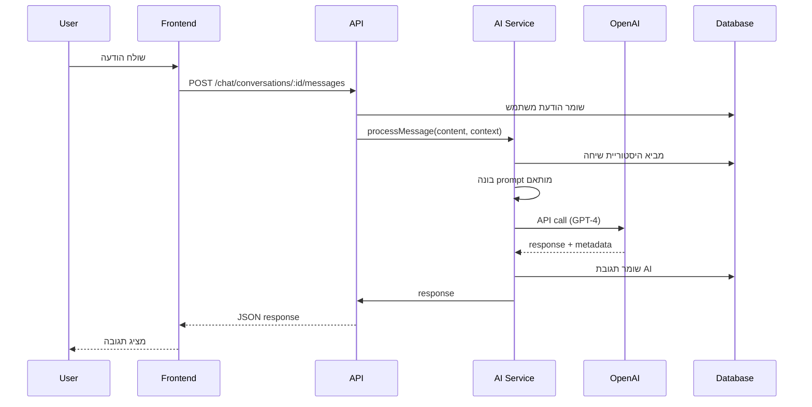

# אִיפיון פרויקט שדרוג אתר Tagishli

## 1. מסמך ראייה (Vision Document)

### מטרות הפרויקט

הפרויקט נועד לשדרג את אתר [tagishli.co.il](http://tagishli.co.il/) מאתר סטטי מבוסס-טפסים לפלטפורמה מודרנית מונעת-AI המאפשרת למשתמשים להגיש תביעות משפטיות בצורה אינטואיטיבית, מהירה ונגישה.

**מטרות עיקריות:**
- **דמוקרטיזציה של גישה משפטית** - הנגשת התהליך המשפטי לציבור הרחב ללא צורך בידע מקצועי
- **חיסכון בזמן ועלויות** - צמצום משמעותי בזמן הכנת תביעה מימים לדקות
- **שיפור איכות התביעות** - סיוע AI בניסוח, השלמת מידע ואימות נתונים
- **חוויית משתמש מעולה** - ממשק שיחתי טבעי ואינטואיטיבי במקום טפסים מורכבים

### קהל יעד

1. **אזרחים פרטיים** - ללא רקע משפטי, המבקשים להגיש תביעות קטנות (ספאם, רכב, חובות)
2. **בעלי עסקים קטנים** - המעוניינים לטפל בתביעות עסקיות בסיסיות ללא עורך דין
3. **קהל צעיר** (25-45) - בעלי זיקה לטכנולוגיה ומעדיפים פתרונות דיגיטליים
4. **משתמשים דוברי עברית** - תמיכה מלאה בשפה העברית ובהבנות שפה טבעית

### ערך מוסף ייחודי (USP)

**"עורך הדין האישי שלך, זמין 24/7, ללא עלויות"**

- **AI שיחתי בעברית** - ממשק שיחה טבעי המבין עברית ומקצועית משפטית
- **ניסוח תביעות אוטומטי** - יצירת טיוטות תביעה מקצועיות על בסיס שיחה פשוטה
- **תהליך מודרך חכם** - AI שואל שאלות רלוונטיות ומכוון את המשתמש
- **אימות והשלמה אוטומטית** - בדיקת נתונים, השלמת מידע חסר והצעת שיפורים
- **מעקב ושקיפות** - מערכת ניהול תביעות עם עדכונים בזמן אמת

### הבדלים מהאתר הקיים

| **תכונה** | **אתר קיים (tagishli.co.il)** | **אתר חדש** |
|-----------|-------------------------------|-------------|
| **ממשק** | טפסים סטטיים עם שדות רבים | שיחה AI אינטראקטיבית |
| **חוויית משתמש** | מבולגנת, דורשת ידע מוקדם | מודרכת, אינטואיטיבית |
| **עיצוב** | בסיסי, לא מודרני | מודרני, נקי, מקצועי |
| **תהליך** | מילוי טופס ארוך → שליחה | שיחה → יצירת טיוטה → עריכה → שליחה |
| **סיוע** | אין | AI מנתח, מציע ומשפר |
| **נגישות** | מוגבלת | WCAG 2.1 AA |
| **רספונסיביות** | חלקית | מלאה (Mobile-First) |
| **מעקב** | אין | דשבורד אישי עם סטטוסים |

---

## 2. דרישות תפקודיות (Functional Requirements)

### אינטגרציית AI

#### 2.1 מנוע שיחה (Chatbot Engine)

**תיאור:**
AI שיחתי המשמש כנקודת הכניסה המרכזית לתהליך הגשת התביעות. המנוע מבין שפה טבעית בעברית, מנתח את מטרת המשתמש ומנחה אותו בתהליך.

**יכולות נדרשות:**
- הבנת שפה טבעית בעברית (NLP) ברמה גבוהה
- זיהוי כוונת משתמש (Intent Recognition) - זיהוי סוג התביעה מתוך תיאור חופשי
- ניהול הקשר שיחה (Context Management) - זכירת מידע לאורך השיחה
- שאלות הבהרה דינמיות - יצירת שאלות רלוונטיות בהתאם לסוג התביעה
- תמיכה במספר תביעות במקביל

**תרחישי שימוש:**

**Use Case 1: התחלת שיחה - תביעת ספאם**
```
משתמש: "קיבלתי הרבה הודעות ספאם מחברה"
AI: "אני כאן לעזור לך להגיש תביעה. נראה שמדובר בהודעות ספאם. כמה הודעות קיבלת בערך?"
משתמש: "בערך 50 הודעות ב-3 חודשים"
AI: "האם ביקשת מהם להפסיק לשלוח לך הודעות?"
→ AI ממשיך לשאול שאלות רלוונטיות עד שיש מספיק מידע
```

**Use Case 2: זיהוי סוג תביעה לא ברור**
```
משתמש: "המכונית שלי ניזוקה והתעלמו ממני"
AI: "אני רוצה להבין טוב יותר. מי גרם לנזק למכונית? חברת ביטוח, מוסך, או אדם אחר?"
משתמש: "המוסך לא תיקן כמו שהבטיח"
AI: "הבנתי. נכין ביחד תביעה נגד המוסך. מה בדיוק הבעיה שהם לא תיקנו?"
```

**Use Case 3: השלמת מידע חסר**
```
AI: "כדי להגיש את התביעה, אני צריך את הפרטים הבאים:
    1. שם החברה המלא ✓
    2. מספר ח.פ. ✗
    3. תאריך התקרית הראשונה ✓
    4. הסכום הנתבע ✗
    
האם אתה יודע מה מספר ח.פ. של החברה?"
משתמש: "לא"
AI: "אין בעיה, אני יכול לחפש את המידע הזה בשבילך. מה שם החברה?"
```

#### 2.2 ניתוח ונִיסוח תביעות (Claim Drafting AI)

**תיאור:**
מודול AI המנתח את המידע שנאסף בשיחה ויוצר טיוטת תביעה משפטית מקצועית.

**יכולות נדרשות:**
- זיהוי עילות תביעה רלוונטיות מתוך דיון חופשי
- ניסוח משפטי פורמלי על בסיס שפה רגילה
- התאמת תבניות משפטיות לסוג התביעה
- חישוב סכומי תביעה מומלצים (על בסיס תקדימים)
- הוספת סעיפי חוק רלוונטיים אוטומטית
- הצעת ראיות נדרשות

**תרחישי שימוש:**

**Use Case 4: יצירת טיוטה ראשונית**
```
Input: נתוני שיחה (50 הודעות ספאם, בקשה להפסקה שנדחתה, שם החברה, תאריכים)
Output: 
"בית המשפט לתביעות קטנות ב[עיר]
התובע: [שם המשתמש]
הנתבע: [שם החברה] ח.פ. [מספר]

עילת התביעה:
תביעה בגין הפרת חוק התקשורת (בזק ושידורים), התשס"ח-2008...
הנני מבקש לתבוע סכום של 3,000 ₪ בגין...

העובדות:
1. ביום [תאריך] החל הנתבע לשלוח לי הודעות פרסום...
2. ביום [תאריך] ביקשתי במפורש להסירני מרשימת התפוצה...
..."
```

#### 2.3 אימות והשלמה אוטומטית (Data Validation & Enrichment)

**תיאור:**
מערכת לאימות נתונים שמזין המשתמש והשלמה אוטומטית של מידע חסר מבסיסי נתונים ציבוריים.

**יכולות נדרשות:**
- אימות מספרי ח.פ./ע.מ. דרך API של רשם החברות
- אימות כתובות דרך ממשקי מיפוי
- חיפוש ומילוי אוטומטי של שמות חברות ופרטי התקשרות
- זיהוי DDoS: אם המשתמש שכח פרטים, AI מציע אפשרויות
- בדיקת תקינות תאריכים ועקביות נתונים

**Use Case 5: העשרת נתונים**
```
משתמש: "החברה קוראת 'סלקום'"
AI: → חיפוש ברשם החברות
AI: "מצאתי: סלקום ישראל בע"מ, ח.פ. 570087855. זה נכון?"
משתמש: "כן"
AI: "מעולה! והוספתי גם את כתובת החברה רח' יגאל אלון 47, תל אביב."
```

#### 2.4 מנוע המלצות (Recommendation Engine)

**יכולות:**
- הצעת טיעונים משפטיים נוספים
- המלצה על חיזוק התביעה בראיות
- אזהרה אם סכום התביעה לא סביר
- המלצה על שילוב עילות תביעה נוספות

**Use Case 6: המלצות לשיפור**
```
AI: "בדקתי את התביעה שלך. יש לי מספר המלצות:
    ✓ התביעה נראית טוב מבחינה משפטית
    ⚠️ שים לב: תקדימים דומים זכו לסכום ממוצע של 4,500 ₪. האם לעדכן?
    💡 כדאי להוסיף הוכחה: צילומי מסך של ההודעות עם חותמות זמן
    💡 ציון סעיף 30א לחוק יחזק את הטיעון"
```

---

### תהליכים

#### 2.5 תהליך הגשת תביעה חדשה



**שלבים מפורטים:**

**שלב 1: הזדהות ו-Onboarding (2-3 דקות)**
- התחברות/הרשמה (אימייל + סיסמה או Google/Apple Sign-In)
- אם משתמש חדש: מדריך קצר ("איך זה עובד?")

**שלב 2: שיחה עם AI (5-15 דקות)**
- פתיחת ממשק צ'אט עם אישיות AI ידידותית ("היי, אני כאן לעזור!")
- משתמש מתאר בעיה → AI מזהה Intent
- AI מנחה דרך שאלות:
  - מהות התביעה
  - פרטי הצד השני
  - תאריכים ואירועים
  - נזקים/סכומים
  - ניסיונות פתרון קודמים

**שלב 3: יצירת טיוטה (אוטומטי - 1-2 דקות)**
- AI מנתח את השיחה
- יוצר מסמך תביעה מובנה
- ממלא פערי מידע אוטומטית (חיפוש ח.פ., כתובות)
- מציג למשתמש לסקירה

**שלב 4: עריכה ואישור (5-10 דקות)**
- משתמש רואה תצוגה מקדימה של התביעה
- יכול לערוך ישירות או לבקש מ-AI לשנות
- AI מציע שיפורים והמלצות
- אישור סופי

**שלב 5: מסמכים ותשלום (2-5 דקות)**
- העלאת קבצים (PDF, תמונות) - אופציונלי
- תשלום אגרה (אם רלוונטי) דרך אמצעי תשלום מאובטח
- קבלת אישור

**שלב 6: מעקב**
- משתמש מקבל מספר תיק
- דשבורד אישי עם סטטוס התביעה
- נוטיפיקציות על עדכונים

#### 2.6 ניהול תביעות קיימות

- דף "התביעות שלי" עם טבלת כל התביעות
- סטטוסים: טיוטה | הוגשה | בטיפול | נסגרה
- לחיצה על תביעה → עמוד פירוט עם היסטוריה מלאה
- אפשרות להוריד מסמכים (PDF של התביעה, קבלות)
- הוספת עדכונים/מסמכים למקרה פתוח

#### 2.7 טיפול בכתבי הגנה (Statement of Defense)

**תהליך:**
1. משתמש נכנס לדשבורד ובוחר "הכנת כתב הגנה"
2. AI שואל: מה הנושא של התביעה נגדך?
3. משתמש מעלה את תביעת התובע (PDF/תמונה)
4. AI מנתח את התביעה בצורה אוטומטית:
   - מזהה את העילות
   - מחלץ טענות מרכזיות
   - מציע נקודות הגנה
5. שיחה עם משתמש לליקוט התגובות שלו
6. יצירת כתב הגנה מקצועי

---

## 3. דרישות עיצוב (Design Requirements)

### 3.1 שפה עיצובית (Design System)

#### צבעים (Color Palette)

**Primary Colors:**
- `#1E3A8A` - כחול כהה (מהימנות, מקצועיות משפטית)
- `#3B82F6` - כחול בהיר (טכנולוגיה, AI)
- `#10B981` - ירוק (הצלחה, אישורים)

**Secondary Colors:**
- `#F59E0B` - כתום (התראות, המלצות)
- `#EF4444` - אדום (שגיאות, אזהרות)
- `#6B7280` - אפור (טקסט משני)

**Neutrals:**
- `#F9FAFB` - רקע בהיר
- `#111827` - טקסט ראשי
- `#FFFFFF` - לבן

**Gradients:**
- Hero gradient: `linear-gradient(135deg, #667eea 0%, #764ba2 100%)`
- AI chat bubble: `linear-gradient(120deg, #3B82F6 0%, #8B5CF6 100%)`

#### טיפוגרפיה (Typography)

**פונטים:**
- **ראשי (Headers):** Heebo Bold, sans-serif
- **גוף (Body):** Heebo Regular/Medium, sans-serif  
- **מונו (Code/Legal):** Courier New, monospace

**גדלים:**
- H1: 2.5rem (40px) - Bold
- H2: 2rem (32px) - Bold
- H3: 1.5rem (24px) - SemiBold
- Body: 1rem (16px) - Regular
- Small: 0.875rem (14px) - Regular

**Line Heights:**
- Headers: 1.2
- Body: 1.6
- Legal text: 1.8

#### אייקונים וגרפיקה

- ספרייה: **Heroicons** או **Lucide Icons**
- סגנון: Outlined, 2px stroke
- משקל חזותי: Medium
- איורים: Minimal, flat design בגוון כחול-סגול

### 3.2 מודרניזציה

**עקרונות עיצוב:**
- **Clean & Minimal** - ממשק נקי ללא עומס חזותי
- **Glassmorphism** - שימוש בקלפים עם `backdrop-filter: blur`
- **Micro-interactions** - אנימציות עדינות (hover, loading, transitions)
- **White Space** - שימוש נדיב ברווחים
- **Rounded Corners** - `border-radius: 12-16px`

**אלמנטים ייחודיים:**
- כפתורים עם Shadow + Hover effect
- Input fields עם focus ring בצבע כחול
- Toast notifications עם אנימציית slide-in

### 3.3 ממשק השיחה עם AI

**עיצוב צ'אט:**

````css
.chat-container {
  max-width: 800px;
  margin: 0 auto;
  padding: 2rem;
}

.message-user {
  background: #F3F4F6;
  border-radius: 18px 18px 4px 18px;
  padding: 12px 16px;
  margin-left: auto;
  max-width: 70%;
  text-align: right;
}

.message-ai {
  background: linear-gradient(120deg, #3B82F6 0%, #8B5CF6 100%);
  color: white;
  border-radius: 18px 18px 18px 4px;
  padding: 12px 16px;
  max-width: 70%;
  box-shadow: 0 4px 12px rgba(59, 130, 246, 0.3);
}

.typing-indicator {
  /* 3 dots animation */
}
````

**אלמנטים מיוחדים:**
- Avatar של AI (אייקון משפטי מודרני)
- Typing indicator (שלוש נקודות נעות)
- Quick replies (כפתורי תשובה מהירה)
- Rich messages (קלפים עם כפתורים)
- תצוגת מסמכים בתוך הצ'אט

### 3.4 רספונסיביות

**Breakpoints:**
- Mobile: < 640px
- Tablet: 640px - 1024px
- Desktop: > 1024px

**דרישות:**
- Mobile-First approach
- אופטימיזציה מלאה לנייד (80% מהתעבורה)
- טסטים במגוון מכשירים (iOS Safari, Chrome Android)
- ממשק צ'אט מותאם מושלם למובייל

### 3.5 נגישות (WCAG 2.1 AA)

**דרישות:**
- ניגודיות צבעים 4.5:1 (טקסט רגיל), 3:1 (טקסט גדול)
- תמיכה מלאה ב-Screen Readers
- ניווט מלא ב-Keyboard (Tab, Enter, Esc)
- ARIA labels לכל אלמנטים אינטראקטיביים
- Focus indicators ברורים
- תמיכה ב-RTL (עברית)
- אפשרות להגדלת פונטים
- Captions לווידאו/אודיו (אם יש)

---

## 4. ארכיטקטורה טכנית

### 4.1 מבנה כללי



### 4.2 המלצות טכנולוגיות

#### Frontend

**Framework:** **React 18+ (Vite)**
- **סיבה:** אקוסיסטם עשיר, ביצועים מעולים, תמיכה ב-RTL מצוינת
- **חלופות:** Next.js (אם צריך SSR לSEO)

**State Management:** **Zustand**
- **סיבה:** פשוט, קליל, פחות boilerplate מ-Redux
- **חלופה:** Redux Toolkit (אם הפרויקט גדול מאוד)

**UI Components:**
- **Headless UI** + **Tailwind CSS**
- **Radix UI** (Accessible components)
- **Framer Motion** (אנימציות)

**Form Management:**
- **React Hook Form** + **Zod** (Validation)

**HTTP Client:**
- **Axios** או **TanStack Query** (React Query)

**Testing:**
- **Vitest** (Unit tests)
- **Playwright** (E2E tests)

#### Backend

**Framework:** **Node.js + Express**
- **סיבה:** גמישות, אקוסיסטם ענק, אינטגרציה קלה עם AI APIs
- **חלופה:** NestJS (אם רוצים TypeScript מובנה + ארכיטקטורה מובנית)

**Language:** **TypeScript**
- **סיבה:** Type safety, פחות באגים, IDE support מצוין

**API Design:** **REST** + **GraphQL** (למעקב דשבורד)

**Authentication:**
- **JWT** (Access + Refresh tokens)
- **Passport.js** (אימות Google/Apple)
- **bcrypt** (הצפנת סיסמאות)

#### Database

**Main DB:** **PostgreSQL 15+**
- **סיבה:** ACID compliance, תמיכה ב-JSON, ביצועים מעולים
- **Schema:**
  - `users` - נתוני משתמשים
  - `claims` - תביעות
  - `conversations` - שיחות עם AI
  - `messages` - הודעות בשיחות
  - `documents` - מידע על קבצים מועלים
  - `payments` - תשלומים

**Caching:** **Redis**
- **שימושים:**
  - Session storage
  - Rate limiting
  - Caching של שיחות פעילות
  - Queue למשימות כבדות (Bull MQ)

**ORM:** **Prisma** או **TypeORM**

#### File Storage

**Cloud Storage:** **AWS S3** או **Azure Blob Storage**
- **סיבה:** אמינות, עלות נמוכה, integration עם CDN
- **אבטחה:** Signed URLs, encryption at rest

#### AI Services

**Primary:** **OpenAI GPT-4 Turbo/GPT-4o**
- **שימושים:**
  - הבנת כוונה (Intent classification)
  - יצירת שאלות follow-up
  - ניסוח תביעות
  - תיקון שגיאות דקדוקיות

**Alternative:** **Anthropic Claude 3 (Sonnet/Opus)**
- **שימוש:** בדיקת עקביות, ניתוח מסמכים ארוכים
- **יתרון:** Context window גדול יותר (200K tokens)

**Hebrew NLP:** **AlephBert** (מודל עברי בסיסי) - אופציונלי
- **שימוש:** Named Entity Recognition (זיהוי שמות חברות, תאריכים)

**Function Calling:**
- שימוש ב-OpenAI Function Calling לקריאות API (חיפוש ח.פ., אימות נתונים)

**Prompt Engineering:**
- שמירת Prompts במערכת (לא בקוד) לגמישות
- A/B Testing של prompts
- מעקב אחר איכות תשובות (logging + human feedback)

#### Deployment & Infrastructure

**Hosting:**
- **Frontend:** **Vercel** או **Netlify**
- **Backend:** **AWS EC2/ECS** או **Railway** או **Render**
- **Database:** **AWS RDS** (PostgreSQL) + **Redis Cloud**

**CI/CD:**
- **GitHub Actions**
- Deploy אוטומטי על push ל-main

**Monitoring:**
- **Sentry** (Error tracking)
- **Datadog** או **New Relic** (Performance monitoring)
- **LogRocket** (Session replay למשתמשים)

### 4.3 אבטחה והצפנה

**תקני אבטחה:**
- HTTPS בלבד (SSL/TLS 1.3)
- Helmet.js (HTTP headers security)
- CORS מוגדר נכון
- Rate limiting (למניעת abuse)
- Input validation על כל endpoint
- SQL Injection prevention (Prepared statements)
- XSS protection

**הצפנה:**
- סיסמאות: bcrypt (12+ rounds)
- נתונים רגישים ב-DB: Encryption at rest
- File uploads: Virus scanning (ClamAV)
- API Keys: Environment variables + Secrets manager

**Compliance:**
- GDPR (אם יש משתמשים מאירופה)
- הגנת פרטיות ישראלית
- שמירת לוגים (לצרכים משפטיים)

---

## 5. מפרט טכני מפורט

### 5.1 מבנה מסד נתונים

#### Schema Overview

```sql
-- טבלת משתמשים
CREATE TABLE users (
  id UUID PRIMARY KEY DEFAULT gen_random_uuid(),
  email VARCHAR(255) UNIQUE NOT NULL,
  password_hash VARCHAR(255),
  full_name VARCHAR(255) NOT NULL,
  phone VARCHAR(20),
  id_number VARCHAR(9) UNIQUE,
  address TEXT,
  auth_provider VARCHAR(50) DEFAULT 'local', -- local, google, apple
  created_at TIMESTAMP DEFAULT NOW(),
  updated_at TIMESTAMP DEFAULT NOW()
);

-- טבלת תביעות
CREATE TABLE claims (
  id UUID PRIMARY KEY DEFAULT gen_random_uuid(),
  user_id UUID REFERENCES users(id) ON DELETE CASCADE,
  claim_type VARCHAR(50) NOT NULL, -- spam, small_claim, car, defense
  status VARCHAR(50) DEFAULT 'draft', -- draft, submitted, in_progress, closed
  defendant_name VARCHAR(255),
  defendant_id_number VARCHAR(20), -- ח.פ. / ע.מ.
  defendant_address TEXT,
  claim_amount NUMERIC(10, 2),
  description TEXT,
  legal_draft TEXT, -- הטיוטה המשפטית שנוצרה
  conversation_id UUID REFERENCES conversations(id),
  submitted_at TIMESTAMP,
  created_at TIMESTAMP DEFAULT NOW(),
  updated_at TIMESTAMP DEFAULT NOW()
);

-- טבלת שיחות
CREATE TABLE conversations (
  id UUID PRIMARY KEY DEFAULT gen_random_uuid(),
  user_id UUID REFERENCES users(id) ON DELETE CASCADE,
  claim_id UUID REFERENCES claims(id) ON DELETE SET NULL,
  status VARCHAR(50) DEFAULT 'active', -- active, completed, abandoned
  created_at TIMESTAMP DEFAULT NOW(),
  updated_at TIMESTAMP DEFAULT NOW()
);

-- טבלת הודעות
CREATE TABLE messages (
  id UUID PRIMARY KEY DEFAULT gen_random_uuid(),
  conversation_id UUID REFERENCES conversations(id) ON DELETE CASCADE,
  role VARCHAR(20) NOT NULL, -- user, assistant, system
  content TEXT NOT NULL,
  metadata JSONB, -- שדה גמיש למידע נוסף
  created_at TIMESTAMP DEFAULT NOW()
);

-- טבלת מסמכים
CREATE TABLE documents (
  id UUID PRIMARY KEY DEFAULT gen_random_uuid(),
  claim_id UUID REFERENCES claims(id) ON DELETE CASCADE,
  user_id UUID REFERENCES users(id),
  file_name VARCHAR(255),
  file_type VARCHAR(50),
  file_size INTEGER, -- bytes
  s3_key VARCHAR(512) NOT NULL, -- path in S3
  uploaded_at TIMESTAMP DEFAULT NOW()
);

-- טבלת תשלומים
CREATE TABLE payments (
  id UUID PRIMARY KEY DEFAULT gen_random_uuid(),
  claim_id UUID REFERENCES claims(id),
  user_id UUID REFERENCES users(id),
  amount NUMERIC(10, 2),
  currency VARCHAR(3) DEFAULT 'ILS',
  payment_method VARCHAR(50),
  transaction_id VARCHAR(255),
  status VARCHAR(50), -- pending, completed, failed
  created_at TIMESTAMP DEFAULT NOW()
);

-- Indexes for performance
CREATE INDEX idx_claims_user ON claims(user_id);
CREATE INDEX idx_claims_status ON claims(status);
CREATE INDEX idx_messages_conversation ON messages(conversation_id);
CREATE INDEX idx_documents_claim ON documents(claim_id);
```

### 5.2 API Endpoints

#### Authentication

```
POST   /api/auth/register
POST   /api/auth/login
POST   /api/auth/refresh
POST   /api/auth/logout
GET    /api/auth/me
POST   /api/auth/google
POST   /api/auth/apple
```

#### Chat & AI

```
POST   /api/chat/conversations          # התחלת שיחה חדשה
GET    /api/chat/conversations/:id      # קבלת שיחה
POST   /api/chat/conversations/:id/messages  # שליחת הודעה
DELETE /api/chat/conversations/:id      # מחיקת שיחה
GET    /api/chat/conversations/:id/summary   # סיכום השיחה
```

**Request Example (Send Message):**
```json
POST /api/chat/conversations/abc123/messages
{
  "content": "קיבלתי 50 הודעות ספאם בחודש האחרון",
  "context": {
    "claimType": "spam"
  }
}
```

**Response Example:**
```json
{
  "id": "msg_xyz",
  "role": "assistant",
  "content": "הבנתי. האם ניסית לבקש מהחברה להפסיק לשלוח לך הודעות?",
  "suggestions": [
    "כן, ביקשתי והם התעלמו",
    "לא, לא ניסיתי",
    "אני לא בטוח"
  ],
  "metadata": {
    "intent": "gather_defense_attempts",
    "confidence": 0.92
  }
}
```

#### Claims

```
POST   /api/claims                 # יצירת תביעה חדשה
GET    /api/claims                 # קבלת כל התביעות של המשתמש
GET    /api/claims/:id             # קבלת תביעה ספציפית
PATCH  /api/claims/:id             # עדכון תביעה
DELETE /api/claims/:id             # מחיקת תביעה (רק draft)
POST   /api/claims/:id/submit      # הגשת תביעה
GET    /api/claims/:id/pdf         # הורדת PDF של התביעה
POST   /api/claims/:id/generate-draft  # יצירת טיוטה מתוך שיחה
```

**Response Example (Get Claim):**
```json
{
  "id": "claim_123",
  "userId": "user_456",
  "claimType": "spam",
  "status": "draft",
  "defendant": {
    "name": "סלקום ישראל בע\"מ",
    "idNumber": "570087855",
    "address": "רח' יגאל אלון 47, תל אביב"
  },
  "claimAmount": 3000,
  "description": "קיבלתי 50 הודעות...",
  "legalDraft": "בית המשפט לתביעות קטנות...",
  "conversationId": "conv_789",
  "createdAt": "2025-11-21T10:00:00Z",
  "updatedAt": "2025-11-21T10:30:00Z"
}
```

#### Documents

```
POST   /api/documents              # העלאת קובץ
GET    /api/documents/:id          # קבלת מידע על קובץ
GET    /api/documents/:id/download # הורדת קובץ
DELETE /api/documents/:id          # מחיקת קובץ
```

#### Payments

```
POST   /api/payments/initiate      # התחלת תהליך תשלום
POST   /api/payments/verify        # אימות תשלום
GET    /api/payments/:id           # סטטוס תשלום
```

### 5.3 AI Integration Flow



**Prompt Template (דוגמה):**
```javascript
const systemPrompt = `
אתה עוזר משפטי AI בשם "עו\"ד דיגיטלי". תפקידך לעזור למשתמשים להגיש תביעות משפטיות בישראל.

הנחיות:
1. דבר בעברית פשוטה וברורה
2. היה סבלני ואמפתי
3. שאל שאלה אחת בכל פעם
4. אמת נתונים ושמור עקביות
5. אל תיתן ייעוץ משפטי אישי - רק סיוע טכני

סוג התביעה הנוכחית: ${claimType}
מידע שנאסף עד כה: ${JSON.stringify(collectedData)}

השלב הבא: ${nextStep}
`;

const userMessage = conversation.messages
  .map(m => `${m.role}: ${m.content}`)
  .join('\n');

const response = await openai.chat.completions.create({
  model: 'gpt-4-turbo',
  messages: [
    { role: 'system', content: systemPrompt },
    { role: 'user', content: userMessage }
  ],
  functions: [
    {
      name: 'enrichCompanyData',
      description: 'חיפוש מידע על חברה ברשם החברות',
      parameters: {
        type: 'object',
        properties: {
          companyName: { type: 'string' }
        }
      }
    }
  ],
  temperature: 0.7,
  max_tokens: 500
});
```

### 5.4 External Integrations

#### רשם החברות API
```javascript
async function fetchCompanyData(companyName) {
  const response = await axios.get(
    'https://data.gov.il/api/3/action/datastore_search',
    {
      params: {
        resource_id: 'f004176c-b85f-4542-8901-7b3176f9a054',
        q: companyName,
        limit: 5
      }
    }
  );
  
  return response.data.result.records.map(r => ({
    name: r['שם_חברה'],
    id: r['מספר_חברה'],
    status: r['סטטוס_חברה']
  }));
}
```

#### Payment Gateway (דוגמה - Tranzila)
```javascript
async function initiateTranzillaPayment({ amount, claimId, userId }) {
  const response = await axios.post('https://secure5.tranzila.com/api', {
    supplier: process.env.TRANZILA_TERMINAL,
    sum: amount,
    currency: 1, // ILS
    tranmode: 'VK', // verification only
    cred_type: 1, // regular payment
    order_id: claimId,
    success_url: `${process.env.APP_URL}/payment/success`,
    fail_url: `${process.env.APP_URL}/payment/fail`
  });
  
  return response.data.payment_url;
}
```

---

## 6. תכנון פיתוח

### 6.1 פירוק לשלבים (Phases)

#### **Phase 1: MVP - Core Chat & Claim Generation (8-10 שבועות)**

**Milestone 1.1: Infrastructure Setup (2 שבועות)**
- Setup Frontend (React + Vite + Tailwind)
- Setup Backend (Node.js + Express + TypeScript)
- PostgreSQL + Redis setup
- Authentication (JWT + local login)
- CI/CD pipeline (GitHub Actions)

**Milestone 1.2: Chat Interface (3 שבועות)**
- UI ממשק צ'אט
- אינטגרציה עם OpenAI API
- שמירת שיחות ב-DB
- Intent recognition בסיסי
- טיפול בהודעות בזמן אמת

**Milestone 1.3: Claim Generation (3 שבועות)**
- מנוע יצירת טיוטות תביעות
- תבניות משפטיות (ספאם, תביעה קטנה)
- עריכת טיוטה בממשק
- ייצוא ל-PDF
- שמירת תביעות ב-DB

**Milestone 1.4: Testing & Bug Fixes (2 שבועות)**
- Unit tests
- E2E tests (Playwright)
- Bug fixes
- UI/UX refinement

**Deliverable:** אפליקציה עובדת המאפשרת שיחה עם AI ויצירת תביעות בסיסיות.

---

#### **Phase 2: Enhanced Features (6-8 שבועות)**

**Milestone 2.1: Data Enrichment (2 שבועות)**
- אינטגרציה עם רשם החברות
- אימות נתונים אוטומטי
- השלמת כתובות וח.פ.

**Milestone 2.2: Document Upload (2 שבועות)**
- העלאת קבצים ל-S3
- תצוגת מסמכים בדשבורד
- Virus scanning
- PDF generation עם מסמכים מצורפים

**Milestone 2.3: User Dashboard (3 שבועות)**
- עמוד "התביעות שלי"
- עמוד פרופיל משתמש
- ניהול תביעות (עריכה, מחיקה)
- היסטורייה ולוגים

**Milestone 2.4: Payment Integration (1 שבוע)**
- אינטגרציה עם שער תשלום (Tranzila/PayPal)
- טיפול בתשלומים
- קבלות

**Deliverable:** מערכת מלאה עם כל הפיצ'רים הליבתיים.

---

#### **Phase 3: Advanced AI & Optimization (4-6 שבועות)**

**Milestone 3.1: AI Improvements (2 שבועות)**
- Fine-tuning של prompts
- A/B testing למודלים שונים (GPT-4 vs Claude)
- Recommendation engine (המלצות לשיפור תביעות)
- ניתוח מסמכים (OCR + AI)

**Milestone 3.2: Performance & Scalability (2 שבועות)**
- Caching (Redis)
- Database query optimization
- Load testing
- CDN setup

**Milestone 3.3: Mobile App (אופציונלי - 2 שבועות)**
- React Native app או PWA
- Push notifications

**Deliverable:** מערכת מאופטמת עם AI משופר.

---

#### **Phase 4: Launch & Monitoring (2 שבועות)**

- Beta testing עם משתמשים אמיתיים
- Bug fixes
- Production deployment
- Monitoring setup (Sentry, Datadog)
- Marketing materials & documentation

**Deliverable:** השקה רשמית.

---

### 6.2 אבני דרך (Milestones Summary)

| Milestone | משך זמן | תאריך יעד (משוער) |
|-----------|---------|-------------------|
| M1: Infrastructure | 2 שבועות | Week 2 |
| M2: Chat Interface | 3 שבועות | Week 5 |
| M3: Claim Generation | 3 שבועות | Week 8 |
| M4: MVP Testing | 2 שבועות | Week 10 |
| M5: Data Enrichment | 2 שבועות | Week 12 |
| M6: Document Upload | 2 שבועות | Week 14 |
| M7: User Dashboard | 3 שבועות | Week 17 |
| M8: Payment | 1 שבוע | Week 18 |
| M9: AI Improvements | 2 שבועות | Week 20 |
| M10: Optimization | 2 שבועות | Week 22 |
| M11: Launch | 2 שבועות | Week 24 |

**סה"כ זמן פיתוח משוער: 5-6 חודשים**

### 6.3 סדרי עדיפויות

**High Priority (Must Have):**
1. ממשק שיחה עם AI
2. יצירת טיוטות תביעות
3. אימות משתמשים
4. שמירת תביעות
5. ייצוא PDF
6. דשבורד בסיסי

**Medium Priority (Should Have):**
7. העלאת מסמכים
8. העשרת נתונים (רשם חברות)
9. תשלומים
10. נוטיפיקציות
11. Mobile responsiveness

**Low Priority (Nice to Have):**
12. Mobile App
13. Recommendation engine
14. A/B testing
15. Multi-language support

---

## 7. שיקולים נוספים

### 7.1 עלויות משוערות

#### עלויות חד-פעמיות (Setup)

| פריט | עלות משוערת |
|------|-------------|
| Domain + SSL | $50/year |
| Design & Branding | $1,000-3,000 |
| Initial Development (External) | $30,000-60,000 |
| **או:** Development (Internal - 2 devs @ 6 months) | $60,000-100,000 |

#### עלויות תפעול חודשיות

| פריט | עלות משוערת |
|------|-------------|
| Hosting (Vercel + AWS) | $200-500/month |
| Database (RDS + Redis Cloud) | $100-300/month |
| OpenAI API (GPT-4) | $500-2,000/month* |
| S3 Storage | $50-150/month |
| Payment Gateway Fees | 2-3% מהתשלומים |
| Monitoring (Sentry + Datadog) | $100-200/month |
| **סה"כ** | **$950-3,150/month** |

*תלוי בכמות שימוש. משוער על 1,000 תביעות/חודש.

#### מודל הכנסות (Revenue Model)

1. **Freemium:**
   - חינם: 1 תביעה ראשונה
   - מנוי: $9.99/חודש (תביעות בלתי מוגבלות)
   
2. **Pay-per-Claim:**
   - $19.99 לתביעה
   - הנחה לחבילות (3 תביעות = $49)

3. **אגרות משפטיות:**
   - העברת אגרות בית משפט (עם עמלה) - 10-15% markup

### 7.2 אתגרים ופתרונות

#### אתגר 1: אמינות משפטית של AI

**בעיה:** AI עלול לייצר תוכן שגוי או לא מדויק משפטית.

**פתרונות:**
- Prompt engineering קפדני עם הדגשת אחריות
- Human-in-the-loop: עורך דין בודק דגימה של תביעות
- Disclaimer ברור שהמערכת היא כלי עזר בלבד
- בדיקות איכות תקופתיות
- אפשרות לדירוג התביעה על ידי המשתמש (feedback loop)

#### אתגר 2: עלויות AI גבוהות

**בעיה:** שימוש נרחב ב-GPT-4 יקר.

**פתרונות:**
- שימוש ב-GPT-3.5-Turbo לשלבים פשוטים
- Caching של תשובות נפוצות
- Rate limiting למניעת שימוש לרעה
- אופטימיזציה של Prompts (פחות tokens)
- שקלול Fine-tuning של מודל זול יותר

#### אתגר 3: שפה עברית

**בעיה:** GPT-4 חזק בעברית אך לא מושלם.

**פתרונות:**
- Prompt בעברית ברורה + דוגמאות
- Post-processing לתיקון שגיאות דקדוק (ספריית `hebrew-nlp`)
- בדיקות QA על דגימות עבריות
- שילוב AlephBert למשימות ספציפיות

#### אתגר 4: אבטחה ופרטיות

**בעיה:** נתונים משפטיים רגישים.

**פתרונות:**
- הצפנה מלאה (in transit + at rest)
- Compliance עם GDPR ותקני פרטיות ישראליים
- Audit logs מפורטים
- גיבויים יומיים מוצפנים
- Multi-factor authentication למשתמשים

#### אתגר 5: Scalability

**בעיה:** עומס גבוה אם האתר מצליח.

**פתרונות:**
- Auto-scaling ב-AWS
- Load balancing
- Database sharding (אם צריך)
- CDN לקבצים סטטיים
- Redis לקונקורנטיות גבוהה

### 7.3 סיכונים וניהולם

| סיכון | הסתברות | חומרה | מניעה/תגובה |
|-------|----------|--------|--------------|
| AI מייצר תוכן שגוי | גבוהה | גבוהה | Prompt engineering + human review |
| עלויות AI יותר גבוהות מהצפוי | בינונית | בינונית | Monitoring + אופטימיזציה מראש |
| Breach אבטחתי | נמוכה | גבוהה מאוד | Security audit + penetration testing |
| תקלות שרת | בינונית | בינונית | High availability + monitoring |
| איטיות בתשובות AI | בינונית | נמוכה | Caching + fallback למודל מהיר יותר |
| משתמשים לא מבינים את הממשק | נמוכה | בינונית | User testing + onboarding מפורט |

### 7.4 דרישות תחזוקה

**יומי:**
- ניטור לוגים ושגיאות (Sentry)
- בדיקת uptime
- תגובה לבאגים קריטיים

**שבועי:**
- סקירת feedback משתמשים
- בדיקת עלויות API
- עדכוני אבטחה

**חודשי:**
- גיבוי מלא של DB
- ניתוח ביצועים
- A/B testing של שינויים

**רבעוני:**
- Security audit
- Code refactoring
- תכנון פיצ'רים חדשים

### 7.5 מדדי הצלחה (KPIs)

#### Product KPIs

1. **Completion Rate:** % משתמשים שמסיימים תביעה (יעד: >70%)
2. **Time to Complete:** זמן ממוצע להגשת תביעה (יעד: <15 דקות)
3. **AI Accuracy:** % תביעות ללא שגיאות משפטיות (יעד: >95%)
4. **User Satisfaction:** דירוג ממוצע (יעד: 4.5/5)

#### Business KPIs

5. **Monthly Active Users (MAU):** (יעד: 1,000 בחודש 3, 5,000 בחודש 12)
6. **Conversion Rate:** % מבקרים שמגישים תביעה (יעד: >10%)
7. **Retention Rate:** % משתמשים חוזרים (יעד: >40%)
8. **Revenue per User:** (יעד: $15 average)

#### Technical KPIs

9. **Page Load Time:** (יעד: <2s)
10. **API Response Time:** (יעד: <500ms)
11. **Uptime:** (יעד: 99.9%)
12. **Error Rate:** (יעד: <0.1%)

---

## סיכום ומסקנות

פרויקט שדרוג אתר Tagishli הוא פרויקט שאפתני המשלב טכנולוגיית AI מתקדמת עם צרכים משפטיים ממשיים. המפתח להצלחה:

1. **AI אמין ומדויק** - השקעה בפיתוח prompts איכותיים ובדיקות מעמיקות
2. **UX פשוט ואינטואיטיבי** - הנגשת תהליך מורכב לציבור הרחב
3. **אבטחה קפדנית** - נתונים רגישים דורשים תשתית מאובטחת
4. **איזון עלויות** - ניהול חכם של עלויות AI לשמירה על רווחיות

הפרויקט ניתן לביצוע ב-**5-6 חודשים** עם צוות של **2-3 מפתחים** (Frontend, Backend, DevOps), ועלויות תפעול משוערות של **$1,000-3,000/חודש**.

**המלצה:** להתחיל ב-MVP (Phase 1) למידול הביקוש, ולאחר מכן להרחיב בהדרגה.
